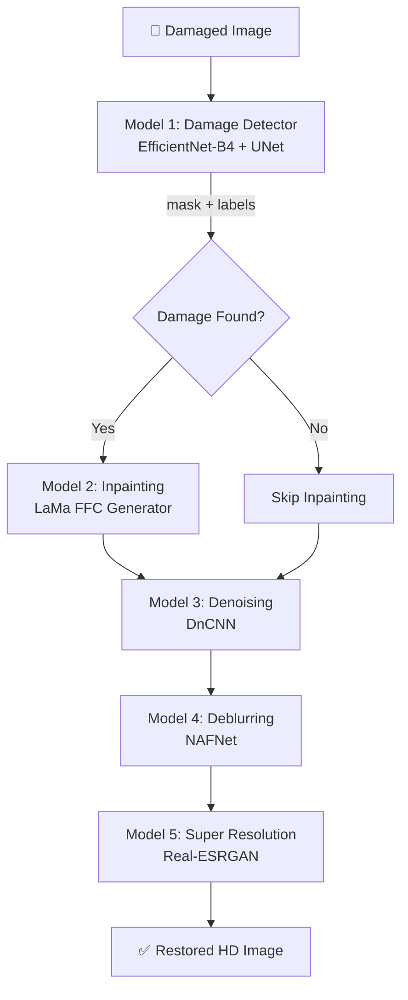

# 🏗️ NeuralRestore — Architecture Reference

This document describes the final, modular architecture of the **NeuralRestore** system.

---

## 🧩 Pipeline Workflow

NeuralRestore runs a 5-model deep learning pipeline sequentially. The execution order is carefully designed because structural restoration (inpainting) must happen before frequency adjustments (denoising/deblurring), and denoising must happen before deblurring to prevent deblurring from amplifying high-frequency noise.

---

## 🤖 The 5-Model Details

### Model 1: Damage Detector
* **Class**: `MultiTaskDamageDetector` in [damage_detector.py](file:///Users/patelvedant548gmail.com/Downloads/image_v2/src/models/damage_detector.py)
* **Architecture**: EfficientNet-B4 encoder + UNet decoder + Fully Connected label classifier.
* **Input**: $256 \times 256$ RGB image, normalized to $[-1, 1]$.
* **Outputs**:
  1. A binary mask indicating pixel-level damage location.
  2. Multi-label logits classifying the presence of 4 classes: `scratch`, `stain`, `crack`, and `dust`.

### Model 2: Inpainting
* **Class**: `LaMaGenerator` in [inpainting.py](file:///Users/patelvedant548gmail.com/Downloads/image_v2/src/models/inpainting.py)
* **Architecture**: Fast Fourier Convolutions (FFC) with residual blocks (specifically designed to handle large masks and structural gaps).
* **Input**: $256 \times 256$ RGB image + binary mask concatenated (4 channels total).
* **Output**: Restored $256 \times 256$ RGB image.
* **Composition**: The output image replaces only the masked pixel locations of the input image, preserving the original unmasked pixels.

### Model 3: Denoising
* **Class**: `DnCNN` in [denoising.py](file:///Users/patelvedant548gmail.com/Downloads/image_v2/src/models/denoising.py)
* **Architecture**: 17-layer DnCNN with residual learning (predicts the noise map and subtracts it from the input).
* **Input**: RGB image.
* **Output**: Denoised RGB image.

### Model 4: Deblurring
* **Class**: `NAFNet` in [deblurring.py](file:///Users/patelvedant548gmail.com/Downloads/image_v2/src/models/deblurring.py)
* **Architecture**: U-Net using activation-free blocks (SimpleGate + Simple Channel Attention).
* **Input**: RGB image.
* **Output**: Sharpened/deblurred RGB image.

### Model 5: Super Resolution
* **Class**: `RealESRGAN` in [super_resolution.py](file:///Users/patelvedant548gmail.com/Downloads/image_v2/src/models/super_resolution.py)
* **Architecture**: Pretrained RRDBNet with 23 blocks upscaling by 4x.
* **Input**: Any size RGB image.
* **Output**: $4\times$ upscaled HD image.

---

## 📁 Directory Structure

* [src/](file:///Users/patelvedant548gmail.com/Downloads/image_v2/src): Contains the main package logic including configurations, app UI, and pipelines.
* [src/models/](file:///Users/patelvedant548gmail.com/Downloads/image_v2/src/models): Contains individual PyTorch model module definition files.
* [src/utils/](file:///Users/patelvedant548gmail.com/Downloads/image_v2/src/utils): Shared utility helpers for preprocessing and loading.
* [weights/](file:///Users/patelvedant548gmail.com/Downloads/image_v2/weights): Stores all model checkpoint files (`.pth`).
* [data/](file:///Users/patelvedant548gmail.com/Downloads/image_v2/data): Stores training dataset splits.

